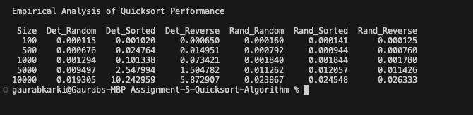

# Performance Analysis

Time Complexity of Quicksort in the best, average, and worst cases:

**Best Case** (O(n logn)): When the pivot divides the array into two equal halves in each step  
**Average Case** (O(n logn)): When the pivot divides in fairly balanced partitions  
**Worst Case** (O(n^2)): If the pivot selection is either the smallest or largest element, resulting in unbalanced partitions.

In the Quicksort, each partition step processes all the n elements listed in the array, When the array is split into two equal halves, the time complexity becomes O(log n) which results in O(n logn) total comparisons. Whereas, if the partitions are unbalanced that is if the pivot selection is either the smallest or largest element, the complexity becomes O(n). That means each level or step requires O(n) work which results in O(n^2) total comparisons.

## Space Complexity:

Quicksort sorts the array in place and does not use additional data structure. It swaps elements with the given array so its extra memory usage is constant O(1) auxiliary space. In the best and average case, when the array is divided into two equal halves, the depth of the recursion tree is  O(log n) which means the number of recursive function calls stored in memory at any time is O(logn)

## Randomized Quicksort

Randomized Quicksort includes the random nature of pivot selection which reduces the probability of getting the worst-case partitioning. The probability of picking poor pivots is low when running over multiple instances. The time complexity is (O(n logn)).

##  Empirical Analysis

The above table is generated by measuring the execution time (in seconds) for both deterministic and randomized quicksort on various data input sizes and distributions.

Observed Results: 

* Deterministic QuickSort performs poorly on sorted and reverse-sorted inputs. The execution time increases significantly due to the worst-case scenario which results in O(n^2) complexity. Looking at the table, For 10000 elements, sorted input took 10.24 seconds while random input only took 0.019 seconds.  
* Randomized Quicksort performs consistently well across all the input types. Looking at the table, Even on the sorted input, it took only 0.024 seconds for 10000 elements. It avoids worse-case sncariod by selecting a random pivot resulting in O(n logn) time complexity.  
* Both algorithms performed similarly for the random inputs. Since the poor pivot selection’s probability is low in the random distribution, both deterministic and randomized results in similar results.   
* Time complexity confirms the theoretical analysis. The time complexity of Deterministic Quicksort is O(n^2) in worst-case and Randomized Quicksort is O(n logn) consistently.

